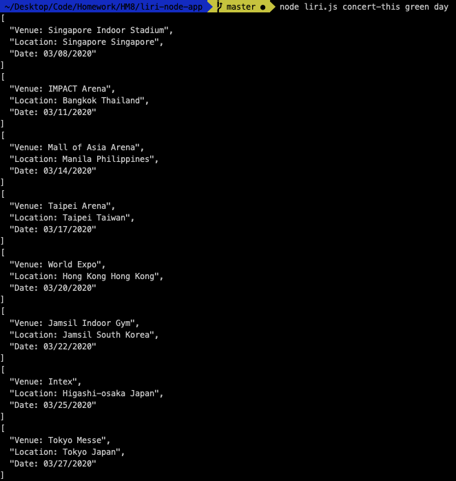
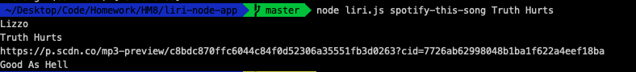
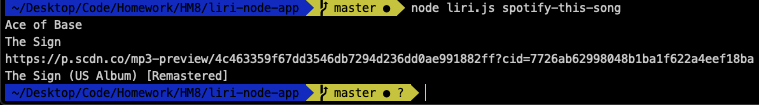
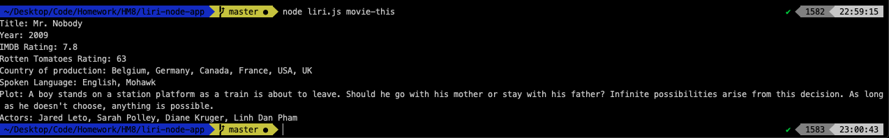
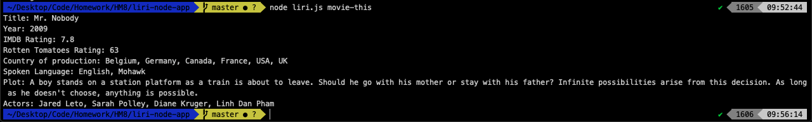

#About: <h1> tag

LIRI Bot is like iPhone's SIRI. However, while SIRI is a Speech Interpretation and Recognition Interface, LIRI is a Language Interpretation and Recognition Interface. LIRI will be a command line node app that takes in parameters and gives you back data.

**Technology used:**

* Node-Spotify-API
* Axios
* Used to make calls to grab data from the OMDB API and the Bands In Town API 
* Moment
* DotEnv

From the command line the user has an option to run the following commands. 

###"concert-this"

Will make a call to the Bands In Town API and return the results of all concerts that matching the artist that the user has entered.

###"spotify-this-song"

Will call the Spotify API and return the results matching the songs user entered. If no song is provided then your program will default to "The Sign" by Ace of Base.

####And empty search:

###"movie-this"###
Will call the IMBD API and display the details of the movie the user searched. If the user doesn't type a movie in, the program will output data for the movie 'Mr. Nobody.

####And empty search:

###"do-what-it-says"
By running this command. The app will read the info from the random.txt and will perform the search per the command stored in the text file. 
    

